<!-- README.md is generated from README.Rmd. Please edit that file -->

# hemispheR

<!-- badges: start -->
<!-- badges: end -->

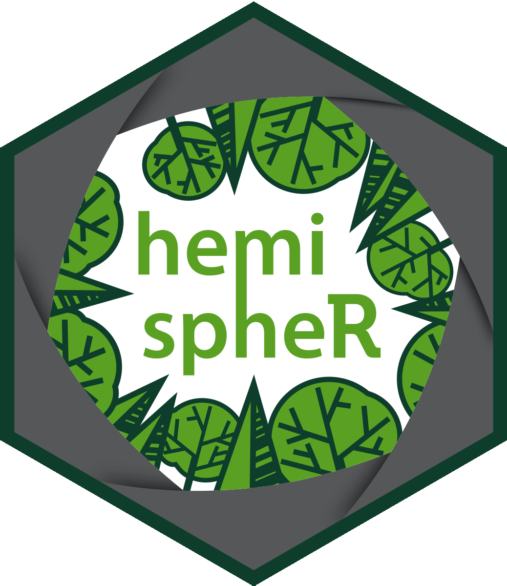

The `hemispheR` package allows processing digital
[hemispherical](https://en.wikipedia.org/wiki/Hemispherical_photography)
(also called fisheye) images (either circular or fullframe) of forest
canopies to retrieve canopy attributes like [canopy
openness](https://www.ecologycenter.us/forest-ecology/measuring-canopy-closure.html)
and leaf area index
([LAI](https://en.wikipedia.org/wiki/Leaf_area_index)).

## Installation

You can install `hemispheR` from CRAN:

``` r
install.packages('hemispheR')
```

You can install the development version of `hemispheR` using `devtools`:

``` r
# install.packages("devtools")
devtools::install_git("https://gitlab.com/fchianucci/hemispheR")
```

# Import a fisheye image

A distinct feature of (circular) hemispherical images is that a circular
mask should be applied to exclude outer pixels from analyses.

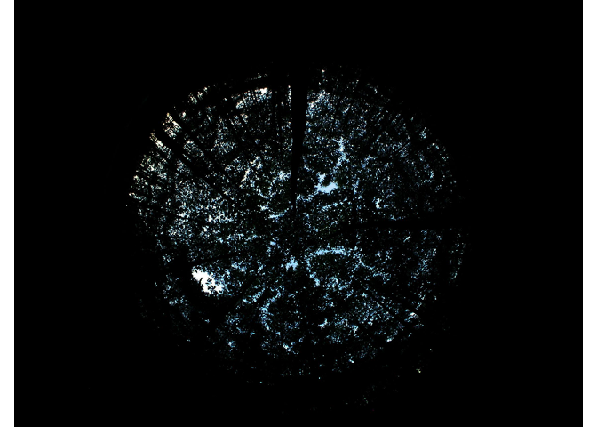

The `import_fisheye()` function allows importing fisheye images as:

``` r
img<-import_fisheye(image,
                    channel = 3,
                    circ.mask=list(xc=1136,yc=852,rc=754),
                    circular=TRUE,
                    gamma=2.2,
                    stretch=FALSE,
                    display=TRUE,
                    message=TRUE)
```

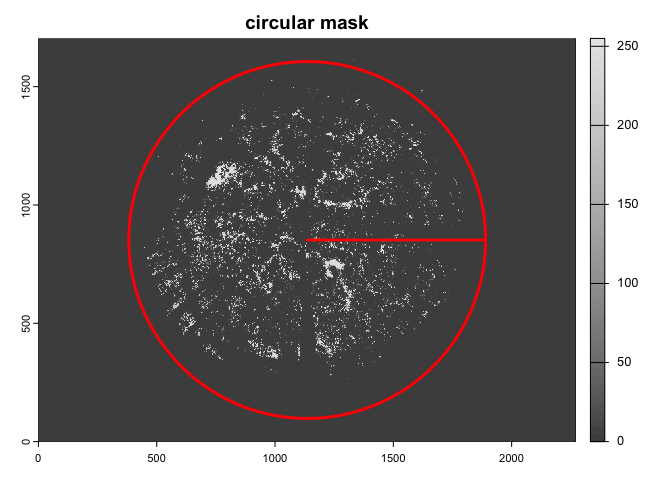

The function has the following parameters:  
- *filename*: the input image name; any kind of image (i.e., raster
matrix) can be read using `terra::rast()` functionality;  
- *channel*: the band number (Default value is 3, corresponding to blue
channel in RGB images, which can be equivalently selected as ‘B’).
Mixing channel options are also available such as ‘GLA’, ‘Luma’, ‘2BG’,
‘GEI’, ‘RGB’, see explanations later;  
- *circ.mask*: a list of three-parameters (x-center (xc), y-center (yc),
radius (rc)) needed to apply a circular mask. These parameters can be
also derived using the `camera_fisheye()` function for known
camera+lenses. If missing, they are automatically calculated;  
- *circular*: it allows to specify if the fisheye image is circular
(*circular*=TRUE) or fullframe (*circular*=FALSE) type; it affects the
way the radius (rc) is calculated in case *circ.mask* is omitted;  
- *gamma*: the actual gamma of the image, which is then back-corrected.
Default value is 2.2, as typical of most image formats (e.g. jpeg
images). If no gamma correction is required, just write *gamma*=1;  
- *stretch*: optionally, users can decide to apply a linear stretch to
the select image channel, to enhance contrast;  
- *display*: if TRUE, a plot of the imported image is displayed along
with the circular mask applied;  
- *message*: if TRUE, a message about the mask parameters applied to
image is printed.

For circular mask, there is an utility function `camera_fisheye()` which
provides the three-parameters for a long list of camera+fisheye
equipments, which can be screened by typing `list.cameras` as in the
example below:

``` r
list.cameras
#>  [1] "Coolpix950+FC-E8"  "Coolpix990+FC-E8"  "Coolpix995+FC-E8" 
#>  [4] "Coolpix4500+FC-E8" "Coolpix5000+FC-E8" "Coolpix5400+FC-E9"
#>  [7] "Coolpix8700+FC-E9" "Coolpix8400+FC-E9" "Coolpix8800+FC-E8"
#> [10] "D60+Sigma-4.5"     "D80+Sigma-4.5"     "D90+Sigma-4.5"    
#> [13] "D300+Sigma-4.5"    "EOS300+Regent-4.9" "EOS20D+Sigma-4.5" 
#> [16] "EOS30D+Sigma-4.5"  "EOSXSi+Sigma-4.5"  "EOST1i+Sigma-4.5" 
#> [19] "EOST2i+Sigma-4.5"  "EOST3i+Sigma-4.5"
```

Using the `camera_fisheye()`, the importing will be:

``` r
img<-import_fisheye(image,
                    circ.mask=camera_fisheye('Coolpix4500+FC-E8'))
```

The `import_fisheye()` function can also import fullframe fisheye
images, by setting *circular*=FALSE:

``` r
img2<-import_fisheye(image2,
               circular=FALSE,
               gamma=2.2,
               display=TRUE,
               message=TRUE)
```

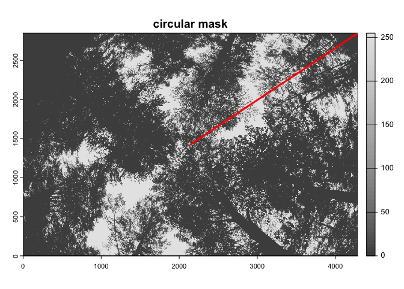

Beside the numeric bands, other options in the `channel` argument are:

$$
GEI=2G-R-B
$$

$$
GLA=\frac{2G-R-B}{2G+R+B}
$$

$$
Luma=0.3R+0.59G+0.11B
$$

$$
RGB=\frac{R+G+B}{3}
$$

$$
2BG=2B-G
$$

Both the Green Excess Index
(‘[GEI](https://www.sciencedirect.com/science/article/abs/pii/S0957417412005635)’)
and the Green Leaf Algorithm
(‘[GLA](https://doi.org/10.1080/10106040108542184)’) are visible (RGB)
vegetation indexes, which are often used for short canopies or
downward-looking images (see also below).
The’[Luma](https://alienryderflex.com/hsp.html)’ method provides a
weighted mean of RGB linear components, which resembles human’s colors
perception (HSP color model). The ‘2BG’ method aimed to enhance contrast
between canopy and sky pixels by lightening the blue and darkening the
green.

Note: you can also process images hemispherical image created from
smartphone panorama images. A tool is described here:
<https://www.azandisresearch.com/2023/05/20/update-smartphone-hemispherical-image-analysis/>.

# Classify images

Once imported, the function performs image classification using a single
automated thresholding from the `auto_thresh()` functionality of the
[autothresholdr](https://CRAN.R-project.org/package=autothresholdr)
package:

``` r
img.bw<-binarize_fisheye(img,
                         method='Otsu',
                         zonal=FALSE,
                         manual=NULL,
                         display=TRUE,
                         export=FALSE)
```

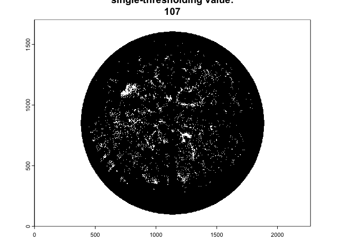

Where:  
- *img*: is the input single-channel raster generated from
`import_fisheye()`;  
- *method*: is the automated thresholding method. Default is set to
‘Otsu’; for For other methods, see:
<https://imagej.net/plugins/auto-threshold>;  
- *zonal*: if set to TRUE, it divides the image in four sectors
(NE,SE,SW,NW directions) and applies an automated classification
separatedly to each region; useful in case of uneven light conditions in
the image;  
- *manual*: alternatively to the automated method, users can insert a
numeric threshold value; in this case, manual thresholding overrides
automated classification;  
- *display*: if set to TRUE, a plot of the classified image is
displayed;  
- *export*: if set tot TRUE, a binary jpeg image is stored in a “result”
folder.

As the `import_fisheye()` function also allows to calculate grenness
indices, the package could be also used for importing and classifying
downward-looking fisheye images:

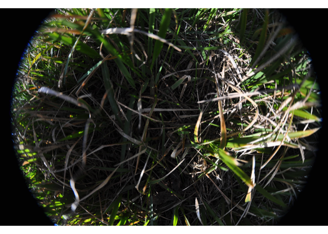

In such a case, we suggest to use the thresholding method=‘Percentile’
in combination with a grenness index:

``` r
downimg |> 
  import_fisheye(channel='GLA',circ.mask=list(xc=2144,yc=1424,rc=2050),stretch=TRUE) |> 
  binarize_fisheye(method='Percentile',display=TRUE) 
```

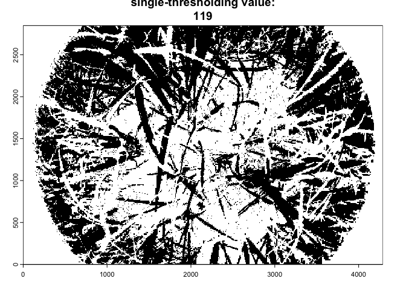

    #> class       : SpatRaster 
    #> dimensions  : 2848, 4288, 1  (nrow, ncol, nlyr)
    #> resolution  : 1, 1  (x, y)
    #> extent      : 0, 4288, 0, 2848  (xmin, xmax, ymin, ymax)
    #> coord. ref. :  
    #> source(s)   : memory
    #> varname     : circular_downward_D90-8-15 
    #> name        : circular_downward_D90-8-15.jpg 
    #> min value   :                              0 
    #> max value   :                              1

# Extract gap fraction from binary images

The `gapfrac_fisheye()` function retrieve the angular distribution from
classified fisheye images, considering the fisheye lens correction, as:

``` r
gap.frac<-gapfrac_fisheye(
  img.bw,
  maxVZA = 90,
  lens = "FC-E8",
  startVZA = 0,
  endVZA = 70,
  nrings = 7,
  nseg = 8,
  display=TRUE,
  message = FALSE
)
```

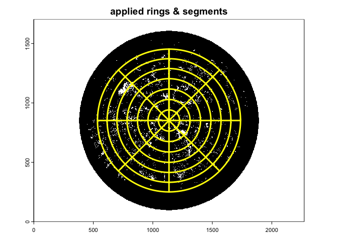

``` r
head(gap.frac)
#>                                        id ring     GF0_45    GF45_90   GF90_135
#> 1 circular_coolpix4500+FC-E8_chestnut.jpg    5 0.04254649 0.12668810 0.05609833
#> 2 circular_coolpix4500+FC-E8_chestnut.jpg   15 0.20285159 0.14235998 0.11460359
#> 3 circular_coolpix4500+FC-E8_chestnut.jpg   25 0.08786911 0.07853917 0.05599374
#> 4 circular_coolpix4500+FC-E8_chestnut.jpg   35 0.05836723 0.10967222 0.03381894
#> 5 circular_coolpix4500+FC-E8_chestnut.jpg   45 0.03144297 0.05687816 0.01977497
#> 6 circular_coolpix4500+FC-E8_chestnut.jpg   55 0.01906895 0.05737915 0.08741001
#>    GF135_180  GF180_225   GF225_270  GF270_315  GF315_360  lens         circ
#> 1 0.04019293 0.06649858 0.006752412 0.03561298 0.07041801 FC-E8 1136_852_754
#> 2 0.12028276 0.04903867 0.056008700 0.06794124 0.04197934 FC-E8 1136_852_754
#> 3 0.09634138 0.06792256 0.106224229 0.10305717 0.06669285 FC-E8 1136_852_754
#> 4 0.08813624 0.11716016 0.061097671 0.08239523 0.04155401 FC-E8 1136_852_754
#> 5 0.06933212 0.11588438 0.073508752 0.02757889 0.03303338 FC-E8 1136_852_754
#> 6 0.07077830 0.19257719 0.036927811 0.06891697 0.01458520 FC-E8 1136_852_754
#>   channel gamma method stretch thd zonal
#> 1       3   2.2   Otsu   FALSE 107 FALSE
#> 2       3   2.2   Otsu   FALSE 107 FALSE
#> 3       3   2.2   Otsu   FALSE 107 FALSE
#> 4       3   2.2   Otsu   FALSE 107 FALSE
#> 5       3   2.2   Otsu   FALSE 107 FALSE
#> 6       3   2.2   Otsu   FALSE 107 FALSE
```

where:  
- *img.bw*: is the input single-channel binary image generated from
`binarize_fisheye()`;  
- *maxVZA*: is the maximum zenith angle (degree) corresponding to the
radius; it is used to perform lens correction. Default value is set to
90;  
- *startVZA*: is the lower zenith angle (degree) used for analysis.
Default values is set to 0;  
- *endVZA*: is the upper zenith angle (degree) used for analysis.
Default value is set to 70;  
- *lens*: define the lens type used for correcting fisheye distortion;
see `list.lenses` for a list of various fisheye lens available. If
omitted, an equidistant projection is assumed by default;  
- *nrings*: number of zenith rings;  
- *nseg*: number of azimuth sectors;  
- *display*: if set to TRUE, it overlaids the image with the zenith and
azimuth bins;  
- *message*: if set to TRUE, it reports the applied mask used in the
analysis.

A suggested setting for comparability with LAI-2000/2200 Plant Canopy
Analyzer (five rings, each about 15 degrees in size) is:

``` r
gap.frac2<-gapfrac_fisheye(
  img.bw,
  maxVZA = 90,
  lens = "FC-E8",
  startVZA = 0,
  endVZA = 75,
  nrings = 5,
  nseg = 8,
  display=TRUE,
  message = FALSE
)
```

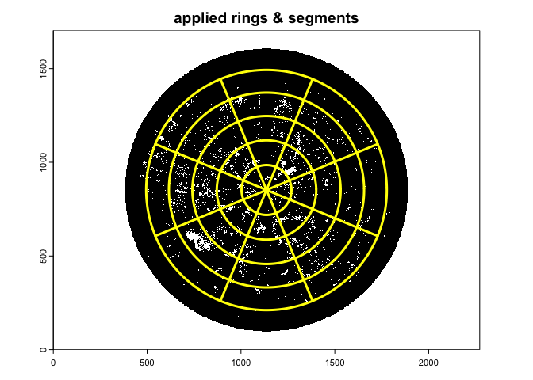

With this setting the *Le* is comparable with the apparent *L* derived
from LAI-2000/2200 (see [Chianucci et
al. 2015](https://doi.org/10.1007/s00468-014-1115-x)).

A suggested setting for implementing the hinge angle method (Bonhomme
and Chartier 1972), which uses a fixed restricted view angle centered at
1 radian - about 57 degree, is:

``` r
gap.frac3<-gapfrac_fisheye(
  img.bw,
  maxVZA = 90,
  lens = "FC-E8",
  startVZA = 55,
  endVZA = 60,
  nrings = 1,
  nseg = 8,
  display=TRUE,
  message = FALSE
)
```

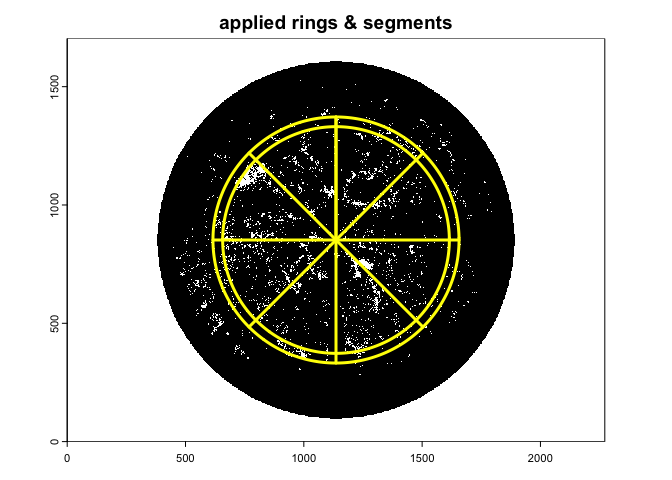

A long list of projection functions is available for the `lens`
argument, which can be screened by typing:

``` r
list.lenses
#>  [1] "equidistant"             "orthographic"           
#>  [3] "stereographic"           "equisolid"              
#>  [5] "Aico-ACHIR01028B10M"     "Aico-ACHIR01420B9M"     
#>  [7] "ArduCam-M25156H18"       "Bosch-Flexidome-7000"   
#>  [9] "Canon-RF-5.2"            "CanonEF-8-15"           
#> [11] "DZO-VRCA"                "Entaniya-HAL-200"       
#> [13] "Entaniya-HAL-250"        "Entaniya-M12-220"       
#> [15] "Entaniya-M12-250"        "Entaniya-M12-280"       
#> [17] "Evetar-E3267A"           "Evetar-E3279"           
#> [19] "Evetar-E3307"            "FC-E8"                  
#> [21] "FC-E9"                   "iZugar-MKX13"           
#> [23] "iZugar-MKX19"            "iZugar-MKX200"          
#> [25] "iZugar-MKX22"            "Kodak-SP360"            
#> [27] "Laowa-4"                 "Lensagon-BF10M14522S118"
#> [29] "Lensagon-BF16M220D"      "Meike-3.5"              
#> [31] "Meike-6.5"               "Nikkor-10.5"            
#> [33] "Nikkor-8"                "Nikkor-OP10"            
#> [35] "Omnitech-ORIFL190-3"     "Raynox-CF185"           
#> [37] "Sigma-4.5"               "Sigma-8"                
#> [39] "SMTEC-SL-190"            "Soligor"                
#> [41] "Sunex-DSL239"            "Sunex-DSL315"           
#> [43] "Sunex-DSL415"            "Sunex-DSLR01"
```

# Infer LAI from angular gap fraction

The `canopy_fisheye()` function inverts angular gap fraction from
fisheye images to derive forest canopy attributes. The function allows
to estimate both effective (*Le*) and actual (*L*) Leaf area index (LAI)
using the [Miller’s (1967)](https://doi.org/10.1071/BT9670141) theorem:

$$
LAI =2 \int_{0}^{\pi/2} -ln[P_0(\theta)] cos\theta \sin \theta d \theta
$$

Effective (*Le*) or actual (*L*) LAI is calculated from the formula
depending on whether the logarithm of the arithmetic
$ln(\overline{P_0(\theta)}$ or geometric $\overline{ln(P_0(\theta))}$
mean $P_0(\theta)$ is considered (see explanation in [Chianucci et
al. 2019](https://doi.org/10.1139/cjfr-2018-0213). The
$cos\theta d\theta$ is normalized to sum as unity.

*Please note that for leaf area inversion, the function replace empty
gaps (where gap fraction is zero) with a fixed value set to 0.00004530
(which corresponds to a saturated LAI value of 10) as the logarithm of
zero gap fraction is not defined.*

Different clumping indices are derived from the `canopy_fisheye()`
function. The [Lang & Xiang
(1986)](https://doi.org/10.1016/0168-1923(86)90033-X) (LX) is calculated
as the ratio of Le to L derived from the Miller theorem.

Two clumping indices (LXG) were derived from an ordered weighted average
(OWA) gap fraction (see [Chianucci et
al. 2019](https://doi.org/10.1139/cjfr-2018-0213)):

$$
\Omega_{LXG}= \frac {-\int_{0}^{\pi/2}ln[\sum_{i=1}^{n}w_i^{'}P_{i\downarrow}\theta]cos\theta d\theta}{{-\int_{0}^{\pi/2}ln[\sum_{i=1}^{n}w_i^{'}P_{i\uparrow}\theta}]cos\theta d\theta}
$$

where w’ is a normalized, non-increasing weighting vector. The
$cos\theta d\theta$ is normalized to sum as unity.

Two weighting vectors are applied:

$$
w_i^{'}=\frac{2(n+1-i)}{n(n+1)}
$$

for $\Omega_{LXG1}$ and

$$
w_i^{'}= \frac{1}{n}\sum_{j=1}^{n}\frac{1}{j}
$$

for $\Omega_{LXG2}$.

The LXG considers both the gap fraction distribution as in LX, and the
gap magnitude, resulting in higher clumping correction than LX. For
details, see [Chianucci et
al. 2019](https://doi.org/10.1139/cjfr-2018-0213)).

Diffuse non-interceptance (*DIFN*) also called *canopy openness* is
calculated as the mean gap fraction weighted for the ring area, as
reported in the LAI-2200 manual (Li-Cor Inc., Nebraska US), (Equation
10-25). Unlike LAI-2200 however, DIFN is calculated from the arithmetic
mean gap fraction of each ring.

Additional variables are the mean leaf tilt angle (*MTA.ell*), which is
calculated from the original formula by [Norman and Campbell
(1989)](https://doi.org/10.1007/978-94-009-2221-1_14) using an
Ellipsoidal distribution with one-parameter *x*. The ellipsoidal
extinction coefficient is given by:

$$
k(\theta,x)=\frac{\sqrt{x^{2}+tan^{2}(\theta)}}{x+1.702(x+1.12)^{-0.708}}
$$

and

$$
MTA.ell=90\times{(0.1+0.9e^{-0.5x})}
$$

From the Ellipsoidal distribution function it is also possible to
calculate the Foliage projection function (G-function;
$G(\theta)=k(\theta,x)\times cos(\theta)$ based on the *MTA.ell*:

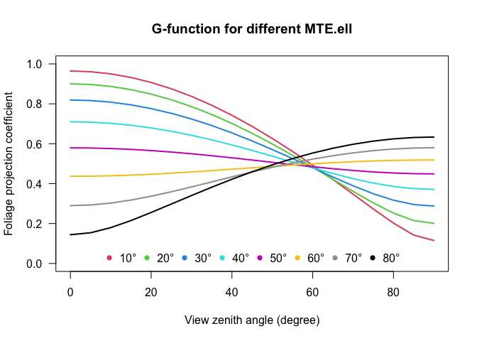

All these algorithms are applied by simply typing:

``` r
canopy<-canopy_fisheye(gap.frac2)
canopy
#> # A tibble: 1 × 20
#>   id         Le     L    LX  LXG1  LXG2  DIFN MTA.ell     x VZA   rings azimuths
#>   <chr>   <dbl> <dbl> <dbl> <dbl> <dbl> <dbl>   <dbl> <dbl> <chr> <int>    <int>
#> 1 circul…  3.65  3.86  0.95  0.84  0.76  6.19      36  2.21 7.5_…     5        8
#> # ℹ 8 more variables: mask <chr>, lens <chr>, channel <chr>, stretch <chr>,
#> #   gamma <chr>, zonal <chr>, method <chr>, thd <chr>
```

# References

Arietta, A.A., 2022. Estimation of forest canopy structure and
understory light using spherical panorama images from smartphone
photography. Forestry, 95(1), pp.38-48.
<https://doi.org/10.1093/forestry/cpab034>

Bonhomme, R. and Chartier, P., 1972. The interpretation and automatic
measurement of hemispherical photographs to obtain sunlit foliage area
and gap frequency. Israel Journal of Agricultural Research, 22,
pp.53-61.

Campbell, G.S., 1986. Extinction coefficients for radiation in plant
canopies calculated using an ellipsoidal inclination angle distribution.
Agricultural and forest meteorology, 36(4), pp.317-321.
<https://doi.org/10.1016/0168-1923(86)90010-9>

Chianucci, F., Macfarlane, C., Pisek, J., Cutini, A. and Casa, R., 2015.
Estimation of foliage clumping from the LAI-2000 Plant Canopy Analyzer:
effect of view caps. Trees, 29(2), pp.355-366.
<https://doi.org/10.1007/s00468-014-1115-x>

Chianucci, F., Zou, J., Leng, P., Zhuang, Y. and Ferrara, C., 2019. A
new method to estimate clumping index integrating gap fraction averaging
with the analysis of gap size distribution. Canadian Journal of Forest
Research, 49(5), pp.471-479. <https://doi.org/10.1139/cjfr-2018-0213>

Chianucci, F. and Macek, M., 2023. hemispheR: an R package for fisheye
canopy image analysis. Agricultural and Forest Meteorology, 336,
p.109470. <https://doi.org/10.1016/j.agrformet.2023.109470>

Landini, G., Randell, D.A., Fouad, S. and Galton, A., 2017. Automatic
thresholding from the gradients of region boundaries. Journal of
microscopy, 265(2), pp.185-195. <https://doi.org/10.1111/jmi.12474>

Lang, A.R.G. and Xiang, Y., 1986. Estimation of leaf area index from
transmission of direct sunlight in discontinuous canopies. Agricultural
and forest Meteorology, 37(3), pp.229-243.
<https://doi.org/10.1016/0168-1923(86)90033-X>

Louhaichi, M., Borman, M.M. and Johnson, D.E., 2001. Spatially located
platform and aerial photography for documentation of grazing impacts on
wheat. Geocarto International, 16(1), pp.65-70.
<https://doi.org/10.1080/10106040108542184>

Miller, J.B. A formula for average foliage density. Australian Journal
of Botany, 15 (1967), pp. 141-144

Norman, J.M. and Campbell, G.S., 1989. Canopy structure. In Plant
physiological ecology: field methods and instrumentation (pp. 301-325).
Dordrecht: Springer Netherlands.
<https://doi.org/10.1007/978-94-009-2221-1_14>
